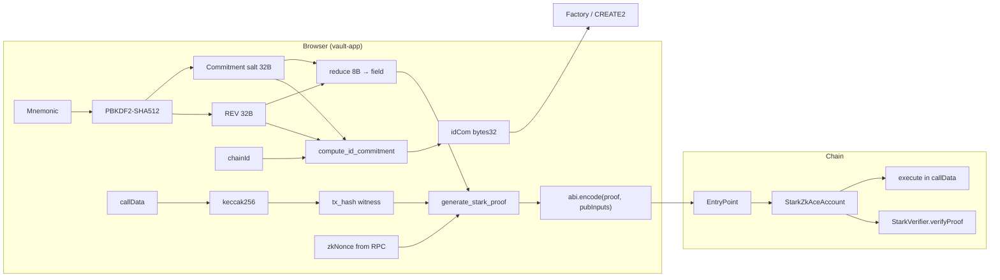

# STARK vault: end-to-end authorization & data flow

Scope: `vault-app` + `zk-ace-stark-wasm` / `zk-ace-stark` + `StarkZkAceAccount` + `StarkVerifier` + factory/E2E tests. Authorization is **STARK-over-Goldilocks** with public inputs bound to **callData** and **chain domain**, not to ERC-4337 `userOpHash`.

## Authorization path (mnemonic → executed call)

1. **Mnemonic → key material (browser):** PBKDF2-HMAC-SHA512 (`600_000` iterations, salt string `ZK-ACE-REV-v1`) → 64 bytes: first 32 = **REV**, last 32 = **commitment salt** (TypeScript `salt` in `deriveKeyMaterial`).
2. **Identity address (browser + factory):** `idCom = computeIdCom(rev, commitmentSalt, chainId)` (Rescue-Prime over three Goldilocks inputs when WASM is ready). `StarkZkAceAccountFactory.getAddress(idCom, factorySalt)` → counterfactual/deployed account (`factorySalt` is `0` in the vault app).
3. **User intent:** Build `callData = encodeFunctionData(execute(dest, value, data))`.
4. **Transaction digest for the proof (browser):** `txHashBytes32 = keccak256(callData)`; witness passes this hex string to WASM.
5. **Witness → proof (WASM → Rust):** JSON witness → `ZkAceWitness` + four field elements for `tx_hash`. Prover builds trace, Winterfell proves; returns `proof` bytes + a vector of **17** public inputs (`pub_inputs[0]` through `pub_inputs[16]`).
6. **UserOp (browser → bundler):** `signature = abi.encode(proof, pubInputs)`. `nonce` = **EntryPoint** `getNonce(sender, key=0)`. Bundler submits to EntryPoint.
7. **Validation (account):** Decode signature; **recompute** `keccak256(userOp.callData)` into four `uint64` mod `P`; check against `pubInputs[13]`, `pubInputs[14]`, `pubInputs[15]`, and `pubInputs[16]`; pack `pubInputs[0..3]` and check `== idCom`; check `pubInputs[12] == uint64(domainTag)`; `StarkVerifier.verifyProof`; then `zkNonce++`.
8. **Execution:** EntryPoint calls `execute` per `callData` after validation succeeds.

## Field-by-field map

| Symbol | What it is | Representation / formula |
|--------|------------|-------------------------|
| **REV** | Identity secret from KDF | 32 bytes in memory; **prover witness uses only** `big_endian_u64(first 8 bytes) mod P` (`reduceBytesToGoldilocks`). |
| **salt** (witness) | Second half of PBKDF output | 32 bytes as `commitmentSalt`; **same 8-byte → field reduction** as REV for the circuit input named `salt`. |
| **idCom** | Identity commitment | `bytes32` = four Goldilocks limbs BE-packed: `RescueHash_full(rev_field, salt_field, domain_field)` (WASM `compute_id_commitment` / `compute_public_inputs`). |
| **target** | Derivation tag (public) | `RescueHash_full(RescueHash_full(rev, alg_id, ctx_domain, ctx_index))` — **not** compared to any separate on-chain root by the account; only bound via STARK boundary columns 4–7. |
| **rpCom** | Replay-binding digest | `RescueHash_full(id_com[0..3], nonce_field)` (five inputs: four id limbs + nonce). |
| **domain** | Chain / context tag | Single Goldilocks element = witness `domain` / public input index 12; account requires `pubInputs[12] == uint64(domainTag)` and `domainTag == block.chainid` at deploy. |
| **txHash** (public inputs) | Call binding | `keccak256(userOp.callData)` as `uint256`, split into four `uint64`: `(>>192)%P`, `(>>128)&mask %P`, `(>>64)&mask %P`, `&mask %P` — must equal `pubInputs[13]`, `pubInputs[14]`, `pubInputs[15]`, and `pubInputs[16]`. **Not** the EntryPoint userOp hash. |
| **zkNonce** | In-account sequence | Storage `uint256`; witness `nonce` must match value **before** increment; account does `zkNonce++` after successful verification. |
| **EntryPoint nonce** | ERC-4337 sequence | `getNonce(account, key=0)`; packed into `userOp.nonce`; validated by `BaseAccount._validateNonce` **independently** of `zkNonce`. |

**Naming collision:** “salt” in the factory is **`uint256 factorySalt`** (CREATE2 mixing). “Salt” in KDF output is **commitment salt** (32 bytes). They are unrelated.

## Cross-language equivalence (compute / check)

| Value | TypeScript (`vault-app`) | Rust / WASM | Solidity account | Solidity verifier |
|-------|-------------------------|-------------|------------------|-------------------|
| REV | PBKDF2 first 32B; reduced to one field for witness | `hex_to_goldilocks` → `ZkAceWitness.rev` | — | — |
| Commitment salt | PBKDF2 last 32B; reduced for witness | `ZkAceWitness.salt` | — | — |
| idCom | `compute_id_commitment` / fallback keccak packing | `rescue_hash_full([rev,salt,domain])`, returned in proof JSON | Packed from `pubInputs[0..3]` vs `idCom` storage | In Fiat-Shamir seed + boundary OOD check vs `publicInputs[0..3]` |
| target | — (fixed `alg_id`, `index` in witness) | `compute_public_inputs` / trace cols 4–7 | — | Boundary + transcript binding |
| rpCom | — | `compute_public_inputs` / trace cols 8–11 | **Not** recomputed in Solidity; comment documents reliance on proof + `zkNonce++` | Boundary + transcript binding |
| domain | `Number(CHAIN_ID)` in witness | `ctx_domain` / `pub_inputs[12]` | `pubInputs[12]` vs `uint64(domainTag)` | `publicInputs[12]` in seed + boundary |
| txHash (pub) | `keccak256(callData)` → hex → WASM splits to 4 elems | `tx_hash_to_elements` | Recomputed from `userOp.callData`, compared to `pubInputs[13..16]` | `publicInputs[13..16]` in seed + boundary |
| zkNonce | Read via `zkNonce()`; witness `nonce = Number(session.zkNonce)`; local `+= 1` after submit | `witness.nonce` → `rp_com` | Increment after verify; no direct on-chain recomputation of `rpCom` from storage | — |
| EntryPoint nonce | `getEntryPointNonce` → `userOp.nonce` | — | `BaseAccount._validateNonce` | — |

## Audit-relevant boundaries

1. **4337 `userOpHash` is ignored** in `_validateSignature` — binding to the user’s action is **`keccak256(callData)`** split into Goldilocks limbs. Any mismatch between bundler packing and client’s `callData` breaks the proof; auditors should confirm **exact** `callData` parity (and that no proxy fields need binding).
2. **Only 8 bytes of REV and of commitment salt** enter the field circuit; the remaining 24 bytes per secret are outside the STARK statement. Security claims must align with this encoding, not with full 32-byte preimage strength inside the proof.
3. **`target` has no independent on-chain check** beyond the verifier — unlike `idCom` / `domain` / `tx_hash` limbs explicitly checked in the account. Understand what `target` is *for* (derivation domain separation inside the AIR) vs what the chain asserts.
4. **`rpCom` is not recomputed on-chain** (Rescue is too heavy); the account comment describes it as `RescueHash_full(idCom, nonce)`, but the Rust prover actually hashes **four `idCom` limbs plus nonce**. Solidity does not compare stored `zkNonce` to `rpCom`; auditors should treat replay binding as a property that depends on the STARK statement and transcript, not on an explicit storage equality check.
5. **Two nonces, two different guarantees:** EntryPoint nonce is checked by `BaseAccount._validateNonce`, so it blocks replay of the same ERC-4337 nonce. `zkNonce` is incremented after proof verification, but the account does **not** explicitly prove or check on-chain that the current stored `zkNonce` matches the nonce committed inside `rpCom`. Because `_validateSignature` also ignores `userOpHash`, auditors should treat reuse of the same authorization blob across fresh EntryPoint nonces with identical `callData` as an open review item, not as a settled invariant.
6. **TypeScript nonce precision / optimism:** the client passes `nonce: Number(session.zkNonce)` into the witness and then does `session.zkNonce += 1n` after submit. That is acceptable only while `zkNonce` remains within JS safe-integer range and the optimistic local increment stays consistent with chain reality after failures/retries.
7. **WASM vs fallback `idCom`:** If WASM fails to load, `computeIdCom` uses a **keccak-based** packing — **not** equivalent to Rescue; vault send path **requires** WASM, but unlock/address preview could diverge from on-chain `idCom` in fallback mode.
8. **Factory `salt = 0`:** All current vault flows use zero factory salt; changing salt changes CREATE2 address without changing `idCom`.

---

*Sources: `vault-app/src/main.ts`, `crates/zk-ace-stark-wasm/src/lib.rs`, `crates/zk-ace-stark/src/prover.rs`, `crates/zk-ace-stark/src/air.rs`, `contracts/src/StarkZkAceAccount.sol`, `contracts/src/StarkVerifier.sol`, `contracts/src/StarkZkAceAccountFactory.sol`, `contracts/test/StarkE2E.t.sol`.*
